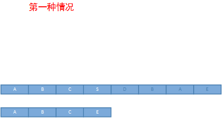
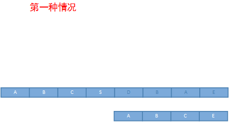

# KMP匹配算法
   - kmp算法证明(主串移动K值=主串不用回溯指针) 
      主串:S=s1s2...si...sn 主串移动个数K 模式串:P=p1p2...pj...pn' 
   - 条件: 主串与模式串匹配，当 si&ne;pj,即存在 p1p2...pj-1 &equiv; si-j+1si-j+2...si-1 
   
       - 归纳法证明：because: P和S不匹配 
            So: S右移动K=1, si-j+2和P的p1开始匹配。 
            假设: 匹配成功。 等价&rArr; p1p2...pj-2 &equiv; si-j+2si-j+3...si-1 
            because: p1p2...pj-1 &equiv; si-j+1...si-1
            &rArr; p2...pj-1 &equiv; si-j+2...si-1 
            So: 等价&rArr;证明 p2...pj-1 &equiv; p1p2...pj-2 
                                        如果不存在模式串不满足上面条件，S与P不匹配。即主串S移动K=1不匹配，需要右移K=2 
            
            If: S[i-j+2,i-1]&ne;P[1,j-2]不匹配，将S向右移动K=2 
            假设: 匹配成功&rArr; p1p2...pj-3 &equiv; si-j+3si-j+4...si-1 
            because: p1p2...pj-1 &equiv; si-j+1...si-1
            &rArr; p3...pj-1 &equiv; si-j+3...si-1 
            So: 等价&rArr;证明 p3...pj-1 &equiv; p1p2...pj-3 
                                        如果模式串不满足上述条件，S与P不匹配。需要将主串向右移动K=3 
            ... 
            If: S[i-j+k-1,i-1]&ne;P[1,j-k+1]不匹配，将S向右移动K=k 
            假设: 匹配成功。 等价&rArr; p1p2...pj-k &equiv; si-j+k...si-1 
            because: p1p2...pj-1 &equiv; si-j+1...si-1
            &rArr; pk...pj-1 &equiv; si-j+k...si-1 
            So: 等价&rArr;证明 pk...pj-1 &equiv; p1p2...pj-k 
                                              如果模式串不满足上述条件，S与P不匹配。需要将主串向右移动K=k+1 
            ... 
            综上所述： 主串S向右移动K,存在这样K=k,使得S[i-k+1,i-1] &equiv; P[1,k-1] 等价&rArr;命题（2） P[1,k-1] &equiv; P[j-k+1,j-1] 
                如果命题（2）不成立，则P、S不匹配。所以 找到P中满足命题（2）的k值，可以找到S的K值。又因为命题(2)成立。 
                模式串P命题（2）可以确定S的K=j-k值，又因为P满足的对称子串，所以S前k-1个元素已经匹配了。所以从Si匹配Pk 
            
            
   - 模式串P已匹配的串中找不到k满足命题（2）的话，S在[i-j+1,i-1]区间的回溯: S都不匹配P 
     - 证明：假设p不存在k满足命题（2），但S中存在K=k'满足 S匹配P，且k'<j 
        因为：存在k' =》 S[i-k'+1,i-1] &equiv; P[1,j-k'+1]  等价&rArr;证明  P[1,j-k'+1] &equiv; P[j-k',j-1] 
        所以：假设不成立。
        
# BM(boyer-moore)高效字符串检索算法
   - 坏字符原则：从模式串的最后一位开始匹配，主串和模式串不匹配的字符，称主串中的那个字符为 '坏字符',不匹配时该'坏字符'在模式串中的位置位k。
        1. 当坏字符在模式串中不存在时，坏字符在模式串中的位置位-1，索引从0开始 
        模式串向右移动距离公式：右移动距离= '坏字符'不匹配时在模式串中的位置 - '坏字符'出现在模式串最右边的位置 
        eg: 主串 S'=ABCSDBAEXO  模式串P'= ABCE
         
        则 S'3=S 和P'3=E不匹配，称S是'坏字符',S在模式串P'中不存在，所以最右边位置=-1 
        则：模式串P向右移动具体：l = 3-(-1)=4 => 从S'4=D和P'1=A对其，从模式串后面开始匹配 
        2. 当'坏字符'在模式串中存在，则'坏字符'出现在模式串最右边的位置位i 
        eg: 主串 S'=ABCSDBAEXO  模式串P'= ABCE
         
        第二次匹配从S'7=E和模式串匹配，然后匹配前一个字符S'6=A,发现不匹配是'坏字符' 
        A在模式串k=2，i=0; 所以模式串右移距离l=2-0=2 =>主串S'6=A和模式串P'0=A对其
   
   - 最好后缀原则：如上图（2）, 'E'即是最好后缀。最好后缀E在模式串中的位置是 3，E在模式串中上一次出现的位置是-1。所以模式串向右移动距离 l= 3-(-1)=4
     S'8和P'0 对齐。
     最好后缀移动距离公式 l= 最好后缀在模式串中的位置（后缀最后字符所在位置） - 最好后缀上传出现的位置（最右边第二次出现的位置）