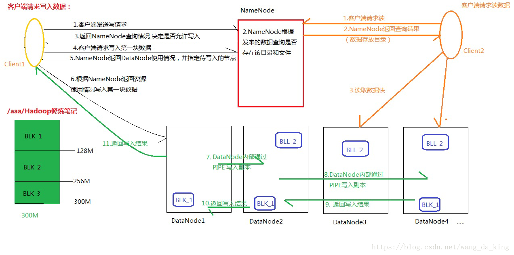
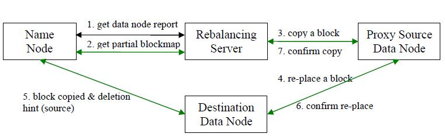

# HDFS 分布式文件系统
    HDFS集群有2类节点管理节点（namenode）、工作者节点（datanode)
- 概念：HDFS是高度容错性、高吞吐量、分布式的文件系统。
    - 高吞吐量：HDFS每个数据Block分布在不同的机柜（Rack）上,根据LRU算法为用户提供检索
    - 高度容错性：每个数据Block会在多个datanode上存储多份副本，默认是3份。可以参数修改（不宜太多，会增加数据同步压力）。
    - 分布式：HDFS将一个完整的文件平均分块（块大小根据具体情况）存储到不同到dataNode计算机上。可以并行读
    - 移动计算：在数据存储的地方计算,而不是把数据移动到计算到地方（MapReducer并行计算框架设计）。
    - 流式数据访问：一次写入，并行读取。不支持动态改变文件内容，只能append。
        
        - namenode 管理文件系统的命名空间，维护这整个文件系统树及整个树内的所有文件和目录。是hadoop的管理者
            是hdfs正常工作的入口。namenode主要的文件是fsimage文件系统映像（元数据信息）和编辑日志edit。会在namenode节点
            内存中保留所有块位置的映射。
            - 元数据信息：里面记录了自最后一次检查点之前HDFS文件系统中所有目录和文件的序列化信息
            - edits:保存了自最后一次检查点之后所有针对HDFS文件系统的操作，比如：增加文件、重命名文件、删除目录等等
            
        - datanode 是工作节点。实际存储hdfs数据块的数据。维护着数据块的位置信息。在datanode启动时，将本地文件对应的hdfs数据块
                列表报告给namenode,报告的是块状态
           - datanode中的文件类型：HDFS块文件（只包含原始数据），
                            数据块的元数据文件，包含版本、类型信息和一系列的校验和
                            
- HDFS存储负载均衡：
    - 上图，所示步骤分析如下：
         - 1、数据平衡服务首先要求 NameNode 生成 DataNode 数据分布分析报告。
         - 2、选择所有的 DataNode 机器后，要求 NameNode 汇总数据分布的具体情况。
         - 3、确定具体数据块迁移路线图，保证网络内最短路径，并且确保原始数据块被删除。
         - 4、实际开始数据块迁移任务。
         - 5、数据迁移任务完成后，通过 NameNode 可以删除原始数据块。
         - 6、NameNode 在确保满足数据块最低副本条件下选择一块数据块删除。
         - 7、NameNode 通知数据平衡服务任务全部完成。
   - HDFS 数据在各个数据节点间可能保存的格式不一致。当存放新的数据块 (一个文件包含多个数据块) 时,
        NameNode 在选择数据节点作为其存储地点前需要考虑以下几点因素：
     
     - 当数据节点正在写入一个数据块时，会自动在本节点内保存一个副本。
     - 跨节点备份数据块。
     - 相同节点内的备份数据块可以节约网络消耗。
     - HDFS 数据均匀分布在整个集群的数据节点上。 
   
   - Hadoop HDFS 数据自动平衡脚本使用方法
     - 运行 start-balancer.sh 脚本
     格式：$Hadoop_home/bin/start-balancer.sh –threshold<threshold>
     
     清单 1. 运行脚本
     ```
     $Hadoop_home/bin/start-balancer.sh
     启动数据平衡，默认阈值为 10%
     bin/start-balancer.sh –threshold 5
     启动数据平衡，阈值 5%
     如何停止数据平衡：
     $Hadoop_home/bin/stop-balancer.sh
     hdfs-site.xml 文件里可以设置每秒钟数据节点间移动数据块的最大速度。
     ```
     清单 2. 设置数据块移动速度
     ```
     <property>
     <name>dfs.balance.bandwidthPerSec</name>
     <value>1048576</value>
     <description> Specifies the maximum bandwidth that each datanode can utilize for the
     balancing purpose in term of the number of bytes per second. </description>
     </property>
     ```
     上面默认是 1MB/s，速度越快完成任务时间也越短，但是这也对机器进程速度有要求。
     
     注意事项：
     
     - 阈值越小表示集群内各节点的 DFS 使用率越相近，每次需要的数据均衡时间也越久。
     - 当应用程序正在使用集群，即对集群进行读写文件操作时，无法达到过于小的阈值。
     - 每次数据节点的数据迁移交互不会超过 10GB 或者指定的阈值大小数据块。每一个交互过程不会大于 20 分钟。
     - 上文说明的修改最大移动数据块速度值需要重新启动 HDFS 服务才能生效。
     - 数据平衡是一个逐渐迭代的过程，可以通过查看输出日志知道这个过程，
     
     清单 3. 日志输出
     ```
     TimeStamp Iteration# Bytes Already Moved Bytes LeftTo Move Bytes Being Moved
     June 13, 2014 8:48:13 PM 0 0 KB 40.88 TB 2.03 TB
     June 13, 2014 8:10:24PM 1 2 TB 38.29 TB 2.01 TB
     June 13, 2014 8:31:06PM 2 3.98 TB 36.38 TB 1.98 TB
     June 13, 2014 8:54:58PM 3 5.94 TB 34.42 TB 1.96 TB
     ```