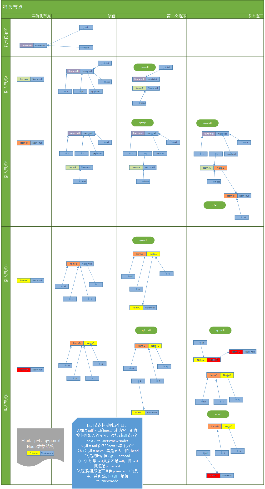
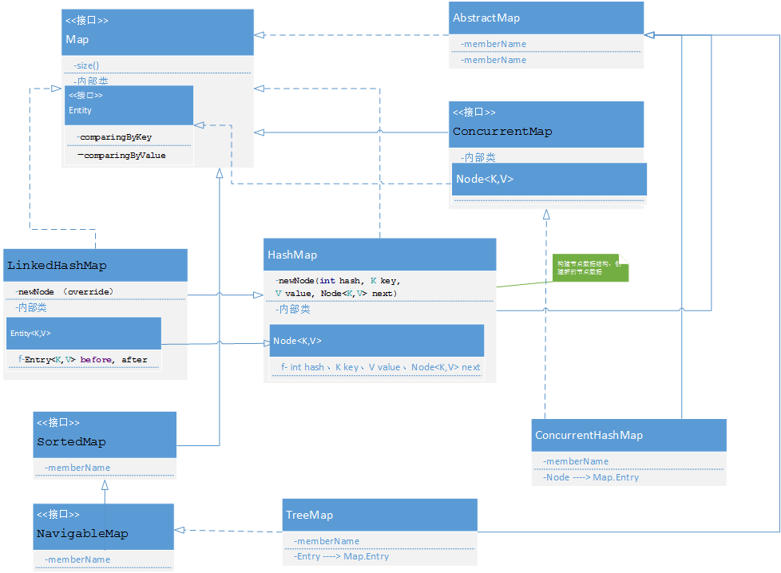
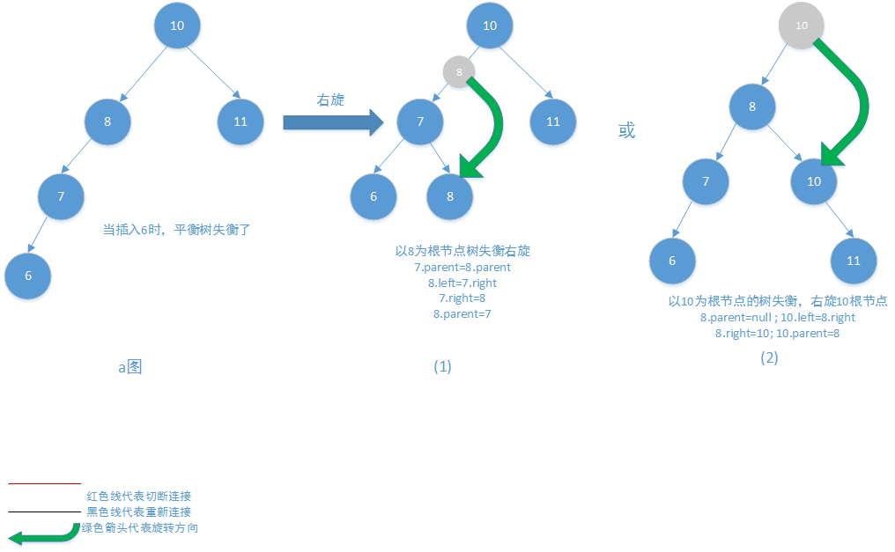
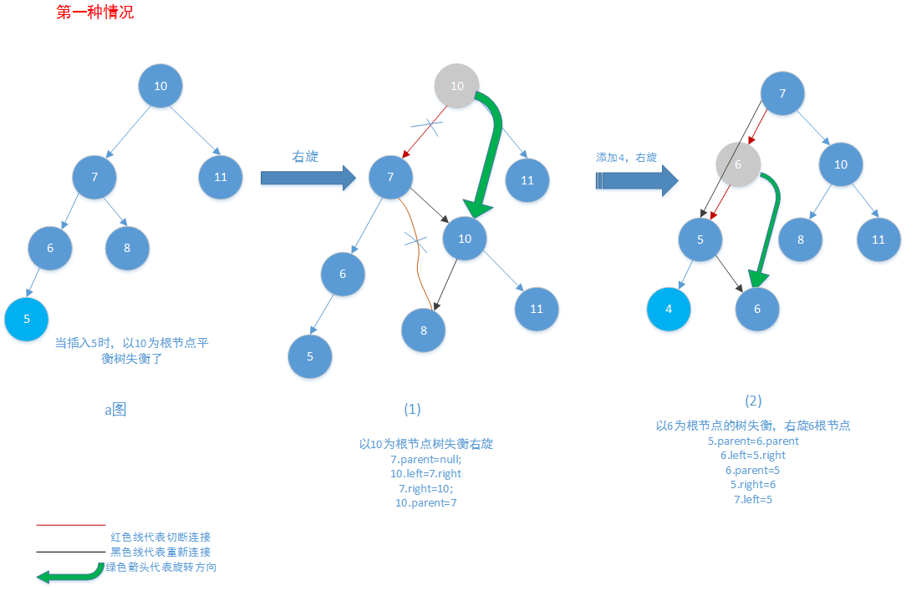
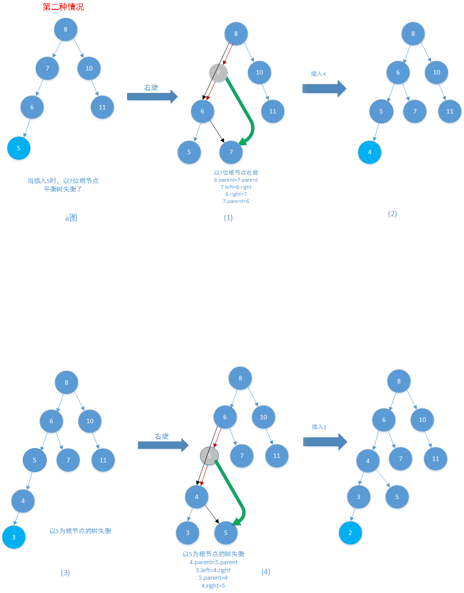

# 集合 Collection、Map
## Collection是set、list、queue的父接口
  - set：是不含重复元素的集合，可以包含null
      - HashSet：无序的、不含重复元素的集合，是通过HashMap实现去重
        ```
            public boolean add(E e) {
                return map.put(e, PRESENT)==null;
            }
        ```
      - LinkedHashSet
        底层调用的是LinkedHashMap
        ```html
           HashSet(int initialCapacity, float loadFactor, boolean dummy) {
                   map = new LinkedHashMap<>(initialCapacity, loadFactor);
               }
        ```
      - EnumSet

  - Queue
      - BlockingQueue阻塞队列:实现类LinkedBlockingQueue，通过重入锁
      Condition  await实现线程挂起，队列阻塞。插入元素时唤醒 Condition signal
      唤醒线程。
      ```
        // 阻塞获取元素
        public E take() throws InterruptedException {
            E x;
            int c = -1;
            final AtomicInteger count = this.count;
            final ReentrantLock takeLock = this.takeLock;
            takeLock.lockInterruptibly();
            try {
                while (count.get() == 0) {
                    //队列为空时，挂起线程，阻塞获取元素
                    notEmpty.await();//LockSupport.park(currentThread)
                }
                x = dequeue();//删除队列的表头元素，并返回该元素
                c = count.getAndDecrement();//现获取元素个数返回，然后-1
                if (c > 1)
                    notEmpty.signal();
            } finally {
                takeLock.unlock();
            }
            if (c == capacity)//删除了一个元素，可以放入元素
                signalNotFull();//唤醒插入元素线程
            return x;
        }
   
        public boolean offer(E e) {
            if (e == null) throw new NullPointerException();
            final AtomicInteger count = this.count;
            if (count.get() == capacity)
                return false;
            int c = -1;
            Node<E> node = new Node<E>(e);
            final ReentrantLock putLock = this.putLock;
            putLock.lock();
            try {
                if (count.get() < capacity) {
                    enqueue(node);
                    c = count.getAndIncrement();
                    if (c + 1 < capacity)
                        notFull.signal();
                }
            } finally {
                putLock.unlock();
            }
            if (c == 0)
                signalNotEmpty();
            return c >= 0;
        }
   
        private void signalNotEmpty() {
           final ReentrantLock takeLock = this.takeLock;
           takeLock.lock();
           try {
               notEmpty.signal();//底层将线程的等待状态修改为唤醒状态
           } finally {
               takeLock.unlock();
           }
       }
     ```
      - ConcurrentLinkedQueue 非阻塞队列。通过CAS（Unsafe类）和算法优化。实现非阻塞
       队列操作。CAS线程安全的操作。算法优化，是哨兵节点控制循环操作出口。<br/>
       <font color='red'>？？第一次操作时：为什么会调用Collection的isEmpty()方法
       更新head节点，到底怎样实现调用的？</font></br>
       ```html
            public boolean offer(E e) {
                checkNotNull(e);
                final Node<E> newNode = new Node<E>(e);
        
                for (Node<E> t = tail, p = t;;) {
                    Node<E> q = p.next;
                    if (q == null) {
                        // p is last node
                        if (p.casNext(null, newNode)) {
                            // Successful CAS is the linearization point
                            // for e to become an element of this queue,
                            // and for newNode to become "live".
                            if (p != t) // hop two nodes at a time
                                casTail(t, newNode);  // Failure is OK.
                            return true;
                        }
                        // Lost CAS race to another thread; re-read next
                    }
                    else if (p == q)
                        // We have fallen off list.  If tail is unchanged, it
                        // will also be off-list, in which case we need to
                        // jump to head, from which all live nodes are always
                        // reachable.  Else the new tail is a better bet.
                        p = (t != (t = tail)) ? t : head;
                    else
                        // Check for tail updates after two hops.
                        p = (p != t && t != (t = tail)) ? t : q;
                }
            }
       ```
       
## Map是键值对集合

  - HashMap:单向链表数组实现的key不重复的键值对集合。key哈希值是数组索引，然后单向链表存储对象。
  如果hash冲突的话，找到索引出的链表，然后放入链表中。根据链表中key值操作链表元素。
  非基本类型类，需要重写key对象的equals和hashCode方法
    - 泛型，传入的是参数化类型（编译器泛型有效，运行时是同一个类型）
        - 泛型类运行原理：编译器强制校验类型，编译为class文件的时候，会擦出类型，替换为Object
        并强制转换类型。所以运行时，并不知道泛型类的实际类型参数。
        - 方法返回类型前加<T> 表示该方法是接受的参数是泛型，而不是类传入的类型参数。
        - FunctionalInterface：函数接口。只有一个抽象方法。（继承Object公开的方法【native实现】，或者default方法都是有默认实现的，不算抽象方法）
        
    - HashMap动态扩展数组长度 ：判断数组和原始数组容量大小，(临界值)threshold << 1 计算新的数组容量newThr并创建new Node[newThr]   
  - ConcurrentHashMap :   线程安全的HashMap。通过同步代码块 put，remove操作保证线程安全。
  - LinkedHashMap : 有插入顺序的HashMap。将输入Entity节点链入一个双向链表的HashMap。
        增加了head、tail Entity节点。
    ```
        //重写了newNode方法，调用下面方法够着双向链表
        private void linkNodeLast(LinkedHashMap.Entry<K,V> p) {
                LinkedHashMap.Entry<K,V> last = tail;
                tail = p;
                if (last == null)
                    head = p;
                else {
                    p.before = last;
                    last.after = p;
                }
            }
    ```
  - TreeMap :红黑树实现的有序HashMap。


## 二叉树 <font size=5px>一个节点最多有2个子节点</font>
  - 二叉树分类
    - 有序二叉树 <font size='4px' color='gray' >如果一个节点有左子树，那么左子树上的节点都小于该节点，如果有右子树，那么右子树上节点都大于该节点</font>
    - 平衡二叉树（AVL） <font size='4px' color='gray'>平衡二叉树是空树或者它的左右两个子树的高度差绝对值不大于1，并且左右两个子树也是平衡二叉树</font>
      - 特性即满足平衡二叉树条件</br>
           1. 是有序二叉树
           2. 左右子树的高度差绝对值不大于1 <font color=red>高度差称为平衡因子</font>
           3. 左右两个子树都是平衡二叉树
    - 红黑树 
      - 满足红黑树条件
           1. 是一棵平衡二叉树
           2. 根节点是黑色
           2. 节点颜色是红色或者黑色
           3. 红色节点的子节点必须是黑色
           4. 叶子节点（NIL）是黑色
           5. <font color=blue>？？对于每一个节点，从该节点到其子孙节点的所有路径包含相同数目的黑节点</font>
  - 平衡二叉树增删操作，平衡二叉树 <font size='4px' color='gray'>节点旋转主要是针对最近不平衡树的根节点，以该不平衡树根节点旋转</font>
    - 右旋 <font size='4px' color='gray'>最近不平衡二叉树的根节点，右旋转原为其子节点的右节点</font>
         
       1. 观察下面（1）、（2）的节点旋转可以发现，（1）寻找最近不平衡树的根节点进行平衡操作，可以快速达到树平衡
         
          
       1. <font color=red>总结：右旋节点操作步骤：根节点root,左节点Rleft,右节点Rright</br>
            1.修改原左节点的父节点为该节点的父节点。Rleft.parent=root.parent</br>
            2.修改该节点的左节点为原左节点的右节点。root.left=Rleft.right</br>
            1.修改原左节点的右节点为该节点。Rleft.right = root</br>
            1.修改该节点的父节点为原左节点。root.parent=Rleft</br>
           </font>
    - 左旋
    
  - 二叉树遍历 <font color=red>先、中、后是相对于根节点来说的</font>
    - 先序遍历 根节点->左子树->右子树
    - <font color=red>中序遍历</font> 左子树->根节点->右子树 
       - 因为是有序二叉树，所有遍历是从小到大遍历
    - 后序遍历 左子树->右子树->根节点
    - 层序遍历 从上到下，从左到右