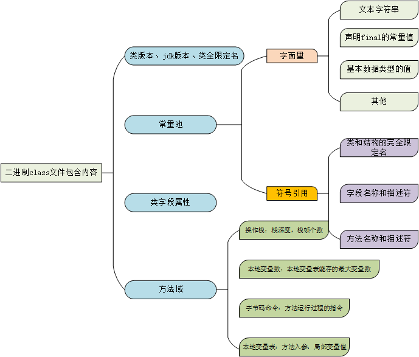
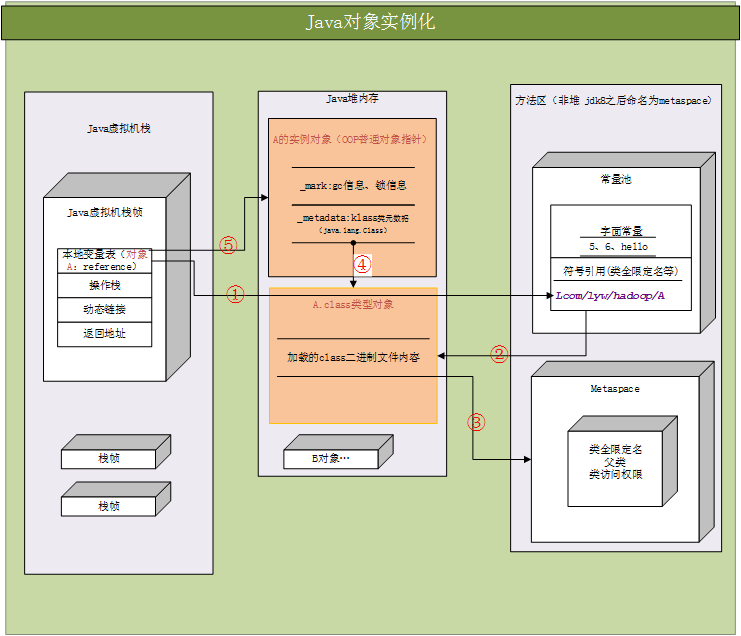

# java 虚拟机

- Java虚拟机内存划分
    - 线程共享：
        - 堆内存：存放各种实例对象数据
        - 方法区：类内存（存放类信息）
                数据内存：运行时数据常量池
                
             classLoader类加载：
            1. class二进制文件读入内存，将其放在运行时数据区的方法区内 (
                <font color=#0009ff>字面量、符号引用会放入常量池中，其他的信息放在metaspace元空间</font>)          
            2. 然后堆中创建一个java.lang.Class对象，用来封装类在方法区内的内数据结构
                            类加载的最终产品是堆区中的Class对象。                 
                           
    - 线程私有：
        - 程序计数器：记录线程执行字节码指令的行数
        - java虚拟栈：Java一个方法对应着一个栈帧（栈帧是虚拟机用来实现函数调用的数据结构），一个方法的调用对应着
            栈帧的入栈、出栈。栈帧保存的信息：方法的局部变量表、方法返回地址、动态链接、操作数栈。因此在编译期就可以
            知道需要多大的局部变量空间，和多深的操作数栈。所以栈帧需要的内存空间是确定的。
            1. 局部变量不会默认初始化值。
            2. 动态链接：class文件中常量池中有很多的变量符号引用。因为在编译的时并不知道所引用对象真实的内存地址，
            就用符号引用代替。等到类加载时或者运行时，将符号引用解析为直接引用，或者对象句柄。这样当它以后再次遇到相同的引用时，
            它就可以立即使用这个直接引用，而不必花时间再次解析这个符号引用了。
            3. 操作数栈：可以实现参数值，和参数列表的传递。iconst_5;istore_1;将常量5入栈，然后将数字5从栈pop,store到索引为1的变量槽（slot)
            eg:数字相加也是在操作数栈里面完成。将栈顶的2个数字取出相加，然后将和入栈。
            4. 局部变量表：如果是非static方法，索引为0的slot是实例化对象引用this。其他的存入的是方法参数和局部变量。局部变量表
            空间slot是可以复用的。
            ```java 
            public class SlotTest{
            
                pubulic void method1(){
                     {byte[] b = new byte[1024*1024];}
                     int a =0;
                     System.gc();
                } 
                
                /**
                *1。如果没有int a= 0；gc的时候因为局部变量表中slot里面的数值没有被重写，还存byte[]的引用，所以不会回收
                *2、a=0;因为b已经超出作用域了，变量槽复用原则，a会重写b的变量槽slot,byte[]的引用没有了，所以会gc回收
                *
                */
               
            }     
            ```
            5. 方法返回地址：当前栈帧出栈时恢复到上个栈帧调用的位置。
        - native方法栈：与Java虚拟栈基本相同，只不过执行的是native方法。
        
- class类文件加载（类加载）
    - 触发类加载的条件：<font color=red>类的直接引用会触发类的初始化操作</font>
        - 主动引用
            1. new 对象
            2. 使用java.lang.reflect反射调用的时候
            3. 子类初始化时发现父类没有初始化，会触发父类初始化
            4. 访问类属性（static）会触发类初始化
            5. 启动main方法的时候，会初始化执行类
        - 被动引用
            1. 子类访问父类的静态域，不会触发子类初始化
            2. 引用常量不会触发类初始化
            3. ??<font color=green>通过数组定义类的引用，不会触发此类初始化</font>
    - class文件加载内存过程
        1. 根据符号引用查找class文件，并将class二进制文件读取到内存
        2. 检查载入的class文件的正确性，给类的静态变量分配存储空间，将符号引用更新为直接引用
        3. 初始化：对类的静态变量、静态代码块执行初始化操作
    - <font color=blue>note:</font>类加载完成后，会在堆内存生成class对象，方法区的metaspace持有
     class对象指针。
- java类实例化 
    - 类实例化
        1. 类加载：class文件加载
        2. 实例化对象：根据metaspace持有的class对象指针，在堆内存中创建一个oop对象（普通对象指针）
           将实例化对象的引用指向oop对象。
           ```text
               //hotspot/src/share/vm/oops/oop.hpp
               class oopDesc {
               private:
                 volatile markOop _mark;//存放gc、锁、空间大小，起始位置等
                 union _metadata {
                   Klass*      _klass; //类元数据（java.lang.Class）指针
                   narrowKlass _compressed_klass;
                 } _metadata;
               }
            ```
    - 当执行new实例化对象<font color=red>每个实例对象都有该类Class对象的引用</font>
       1. 去constant pool检查是否有该对象的符号引用。如果没有找到先执行类的加载过程生成class对象
       2. 根据符号引用获取对象类型，父类，接口、方法等信息。然后在堆内存中分配内存，更新符号引用为直接引用

- java类实例化图解
    
    - ① 通过符号引用先去方法区常量池检查是否已经加载过类型数据class类。如果是直接引用，就直接访问
        堆内存中的对象
    - ② 如果没有class对象，根据类全路径限定名加载class二进制文件到内存metaspace元数据类内存，
        在退内存中生成对应类的class对象，并将class对象引用返回到常量池中并更新符号引用。
    - ③ 堆内存中的类型对象class对象支持访问class二进制在方法区的数据。
    - ④ 然后调用底层c++在堆内存中分配空间，然后根据class对象创建java对象（即oop对象），然后用
        oop对象引用更新栈帧本地变量中的符号引用
    - ⑤ 栈帧中的引用直接访问堆内存中的实例对象数据