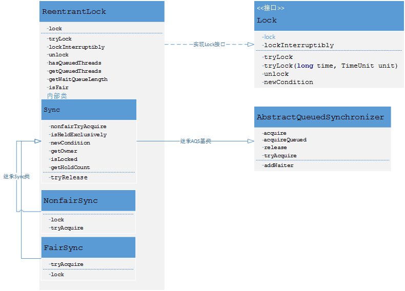

# ReentrantLock重入锁学习

- ReenTrantLock 重入锁（公平锁、非公平锁）
    
    
    - ReenTrantLock类解读
    
    - 这里我们说下Node。Node结点是对每一个访问同步代码的线程的封装，其包含了需要同步的线程本身以及线程的状态，如是否被阻塞，是否等待唤醒，是否已经被取消等。变量waitStatus则表示当前被封装成Node结点的等待状态，共有4种取值CANCELLED、SIGNAL、CONDITION、PROPAGATE。     
      - CANCELLED：值为1，在同步队列中等待的线程等待超时或被中断，需要从同步队列中取消该Node的结点，其结点的waitStatus为CANCELLED，即结束状态，进入该状态后的结点将不会再变化。     
      - SIGNAL：值为-1，被标识为该等待唤醒状态的后继结点，当其前继结点的线程释放了同步锁或被取消，将会通知该后继结点的线程执行。说白了，就是处于唤醒状态，只要前继结点释放锁，就会通知标识为SIGNAL状态的后继结点的线程执行。      
      - CONDITION：值为-2，与Condition相关，该标识的结点处于等待队列中，结点的线程等待在Condition上，当其他线程调用了Condition的signal()方法后，CONDITION状态的结点将从等待队列转移到同步队列中，等待获取同步锁。     
      - PROPAGATE：值为-3，与共享模式相关，在共享模式中，该状态标识结点的线程处于可运行状态。      
      - 0状态：值为0，代表初始化状态。
      - AQS在判断状态时，通过用waitStatus>0表示取消状态，而waitStatus<0表示有效状态。
      
    - lock()方法，默认调用非公平锁NonFairSync.lock()方法，compareAndSetState(0,1)调动底层unsafe.compareAndSwapInt(this, stateOffset, expect, update)
        如果stateOffeset和expect相等，就修改stateOffset的值为update,并返回true，否者什么都不做返回false。
        - a.如果返回true:（即state=1 被锁住了），设置当前线程为reentrantLock的排外线程exclusiveOwnerThread
        - b.如果返回false:调用AQS类acquire(1)方法，
        ```
              if (!tryAcquire(arg) && acquireQueued(addWaiter(Node.EXCLUSIVE), arg))
                selfInterrupt();
              }
        ```
        
        - 条件一：调用NonFairSync.tryAcquire(1)->Sync.nonfairTryAcquire 尝试获取锁
             ```
                  final boolean nonfairTryAcquire(int acquires) {

                      final Thread current = Thread.currentThread();

                      int c = getState();
//获取锁状态  0-未锁  1-被锁住
                      if (c == 0) {

                          if (compareAndSetState(0, acquires)){
//如果是0，尝试获得该锁
                              setExclusiveOwnerThread(current);
//设置该锁的排外线程
                              return true;

                          }

                      }

                      else if (current == getExclusiveOwnerThread()) {
//如果排外线程==当前线程
                          int nextc = c + acquires;

                          if (nextc < 0) // overflow

                              throw new Error("Maximum lock count exceeded");

                              setState(nextc);
//一个线程可以多次获得该锁，获取一次+1  （线程重入锁）
                          return true;

                      }

                      return false;
 //没有获取锁
                  }
             ```
        - 条件二：acquireQueued(addWaiter(Node.EXCLUSIVE), arg)  
                    addWaiter(Node.EXCLUSIVE)将当前线程包装为exclusive node，插入到双向队列中（双向链表方式实现）
                    acquireQueued方法：？？尝试阻断线程
             ```
                    final boolean acquireQueued(final Node node, int arg) {
                        boolean failed = true;//标记是否成功拿到资源
                        try {
                            boolean interrupted = false;//标记等待过程中是否被中断过
                            
                            //又是一个“自旋”！
                            for (;;) {
                                final Node p = node.predecessor();//拿到前驱
                                //如果前驱是head，即该结点已成老二，那么便有资格去尝试获取资源（可能是老大释放完资源唤醒自己的，当然也可能被interrupt了）。
                                if (p == head && tryAcquire(arg)) {
                                    setHead(node);//拿到资源后，将head指向该结点。所以head所指的标杆结点，就是当前获取到资源的那个结点或null。
                                    p.next = null; // setHead中node.prev已置为null，此处再将head.next置为null，就是为了方便GC回收以前的head结点。也就意味着之前拿完资源的结点出队了！
                                    failed = false;
                                    return interrupted;//返回等待过程中是否被中断过
                                }
                                
                                //如果自己可以休息了，就进入waiting状态，直到被unpark()
                                if (shouldParkAfterFailedAcquire(p, node) &&
                                    parkAndCheckInterrupt())//会阻塞当前线程，等待线程被唤醒
                                    interrupted = true;//如果等待过程中被中断过，哪怕只有那么一次，就将interrupted标记为true
                            }
                        } finally {
                            if (failed)
                                cancelAcquire(node);
                        }
                    }
             ```
             ```
                #### method1
                /**
                     * Checks and updates status for a node that failed to acquire.
                     * Returns true if thread should block. This is the main signal
                     * control in all acquire loops.  Requires that pred == node.prev.
                     *
                     * @param pred node's predecessor holding status
                     * @param node the node
                     * @return {@code true} if thread should block
                     */
                    private static boolean shouldParkAfterFailedAcquire(Node pred, Node node) {
                        int ws = pred.waitStatus;//拿到前驱的状态
                        if (ws == Node.SIGNAL)
                            //如果已经告诉前驱拿完号后通知自己一下，那就可以安心休息了
                            return true;
                        if (ws > 0) {
                            /*
                             * 如果前驱放弃了，那就一直往前找，直到找到最近一个正常等待的状态，并排在它的后边。
                             * 注意：那些放弃的结点，由于被自己“加塞”到它们前边，它们相当于形成一个无引用链，稍后就会被保安大叔赶走了(GC回收)！
                             */
                            do {
                                node.prev = pred = pred.prev;
                            } while (pred.waitStatus > 0);
                            pred.next = node;
                        } else {
                             //如果前驱正常，那就把前驱的状态设置成SIGNAL，告诉它拿完号后通知自己一下。有可能失败，人家说不定刚刚释放完呢！
                            compareAndSetWaitStatus(pred, ws, Node.SIGNAL);
                        }
                        return false;
                    }
             
                #### method2
                /**
                     * Convenience method to park and then check if interrupted
                     *
                     * @return {@code true} if interrupted
                     */
                    private final boolean parkAndCheckInterrupt() {
                        LockSupport.park(this);//调用park()使线程进入waiting状态
                        return Thread.interrupted();//如果被唤醒，查看自己是不是被中断的。
                    }
             ```
    - unlock()方法 -> sync.release(1);
    ```
        public final boolean release(int arg) {
                if (tryRelease(arg)) {//尝试释放锁
                    Node h = head;
                    if (h != null && h.waitStatus != 0)
                        unparkSuccessor(h);
                    return true;
                }
                return false;
            }
            
    ```        
        protected final boolean tryRelease(int releases) {
            int c = getState() - releases;
            if (Thread.currentThread() != getExclusiveOwnerThread())
                throw new IllegalMonitorStateException();
            boolean free = false;
            if (c == 0) {//释放锁，设置排外线程为null
                free = true;
                setExclusiveOwnerThread(null);
            }
            setState(c);
            return free;
        }
    ```
    ```
        /**
             * Wakes up node's successor, if one exists.
             *
             * @param node the node
             */
            private void unparkSuccessor(Node node) {
                /*
                 * If status is negative (i.e., possibly needing signal) try
                 * to clear in anticipation of signalling.  It is OK if this
                 * fails or if status is changed by waiting thread.
                 */
                int ws = node.waitStatus;
                if (ws < 0)
                    compareAndSetWaitStatus(node, ws, 0);
        
                /*
                 * Thread to unpark is held in successor, which is normally
                 * just the next node.  But if cancelled or apparently null,
                 * traverse backwards from tail to find the actual
                 * non-cancelled successor.
                 */
                Node s = node.next;
                if (s == null || s.waitStatus > 0) {
                    s = null;
                    for (Node t = tail; t != null && t != node; t = t.prev)
                        if (t.waitStatus <= 0)
                            s = t;
                }
                if (s != null)
                    LockSupport.unpark(s.thread);
            }
    ```