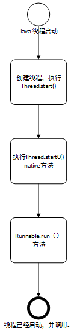

# JDK线程(理解)

## 线程的实现方式(三种方式)
 - Runnable
    - 实现Runnable接口run方法
 - Thread
    - 继承Thread类，重写Thread.run方法
 - Callable和Future实现线程
    - callable作用类似Runnable,run方法没有返回值，call可以有返回值，
    Future可以取到call的返回值，Future的实现类FutureTask同时实现了Runnable
    既可以作为Runnable线程执行，也可以获取执行返回结果
   
   ````
   eg: Callable<Connection> callable = ()-> {
           @Override
           public Connection call() throws Exception {
               System.err.println("进入runnable方法");
               Thread.sleep(2000);
               System.err.println("方法介绍");
               return new Connection();
           }
       };
       FutureTask<Connection> futureTask = new FutureTask<>(callable);
       //线程池执行方式
       Future future = executorService.submit(futureTask);
       //普通线程执行方式
       new Thread(futureTask).start();
       //futureTask 获取线程执行结果 待验证
       Connection conn = futureTask.get();
 - CountDownLatch同步工具类，线程数量初始化一个计数器，等待一些线程执行完成后，继续当前线程执行其他的操作
 ```
    public static void main(String[] args) throws InterruptedException {
            ExecutorService executorService = Executors.newFixedThreadPool(10);
            Thread thread = new OrderThread();
            CountDownLatch countDownLatch = new CountDownLatch(5);//初始线程数量
    
            for (int i = 0; i < 5; i++) {
                final int j = i;
                SyncThread t = new SyncThread();
                executorService.submit(new Runnable() {
                    @Override
                    public void run() {
                        if (j == 0) {
                            t.setTimeout(60000);
                            System.err.println("同步代码块--》"+t.syncCodeBlock(""));
                        }else{
                            System.err.println("同步方法获取年龄--non_sleep"+t.getStaticSyncName());
                        }
                        countDownLatch.countDown();//执行完线程后，初始线程数量-1
    
                    }
                });    
            }
    
            countDownLatch.await();//等待初始线程数=0，唤醒主线程
            System.err.println("子线程都执行完成，继续主线程逻辑");
   }
```
## JDK线程池   
 - jdk线程池父类Executor 
 
  
  - Executors调用底层ThreadPoolExecutor定制不同功能的线程池

       
## 线程的执行方式 
 - Thread.start()方法
    - 
    - Thread构造方法传入Runnable实现，调用Thread.start() -> Thread.native start0() -> Runnable.run方法 
 - 线程池方式执行
   - 
   
   -  
     
# 高并发解决方案
 - 线程池解决方案
    - 实现Runnable接口，封装参数，插入workerQueue队列中
 - 
 
 
 
# 线程同步实现
 - synchronized jvm关键字实现线程同步，synchronized可以修身方法，代码块，但是synchronized不能继承
   - 修饰普通方法，代码块（相当绑定到一个具体的实例化对象上）
        - 锁住的是类实例化对象中所有的同步方法，不影响非普通方法的访问。并且不影响其他实例化对象(锁定非静态同步方法，其他不影响)
        ```java
             public class SyncThread {
             
                 private long timeout;
             
                 public long getTimeout() {
                     return timeout;
                 }
             
                 public void setTimeout(long timeout) {
                     this.timeout = timeout;
                 }

                 public synchronized String getSyncName() {
                     System.out.println(this.hashCode()+" 进入getSyncName方法");
                     return "getSyncName方法未被锁住";
                 }
             
                 public String getName() {
                     System.out.println(this.hashCode()+" 进入getName方法");
                     return "getName非同步方法未被锁住";
                 }
             
                 public synchronized  int getAge() {
                     try {
                         System.out.println(this.hashCode()+" 锁住getAge()方法");
                         Thread.sleep(timeout);
                     } catch (InterruptedException e) {
                         e.getMessage();
                     }          
                     return 20;
                 }
            
                 public static void main(String[] args) throws InterruptedException {
                         ExecutorService executorService = Executors.newFixedThreadPool(10);
                         for (int i = 0; i < 5; i++) {
                             final int j = i;
                             SyncThread t = new SyncThread();
                             executorService.submit(new Runnable() {
                                 @Override
                                 public void run() {
                                     if (j == 0) {
                                         t.setTimeout(60000);
                                         System.err.println("同步方法获取年龄--sleep："+t.getAge());
                                     }else{
                                         t.setTimeout(0);
                                         System.err.println("同步方法获取年龄--non_sleep"+t.getAge());
                                     }
                 
                                 }
                             });
                             Thread.sleep(1000);
                             //非同步方法
                             new Thread(() ->{
                                 if (j == 0)
                                 {
                                     t.setTimeout(6000);
                                     System.err.println("非同步方法："+t.getName());
                                     System.out.println();}}).start();
                 
                             //非同步方法
                             new Thread(() ->{
                                 if (j == 0)
                                 {
                                     t.setTimeout(6000);
                                     System.err.println("同步方法："+t.getSyncName());
                                     System.out.println();
                                 }}).start();
                         }           
                     }
             }
             /**
             *    1.不同的对象调用同步方法getAge(),相互之间没有影响，note:非静态同步方法，绑定到各自的实例化对象上
             *    2.同一个实例化对象，锁定同步方法，不影响非同步方法的调用
             *    3.不同实例化对象，不同锁 
             */
        ```
   - synchronized修身静态方法，锁定的是这个类的所有对象。谁获取这个对象的monitor谁就可以执行这个static方法
        - 锁住的是该类（即对所有实例化的对象），锁住的是静态同步方法
        ```java
             public class SyncThread {
             
                 private long timeout;
             
                 public long getTimeout() {
                     return timeout;
                 }
             
                 public void setTimeout(long timeout) {
                     this.timeout = timeout;
                 }
             
             
                 public synchronized String getSyncName() {
                     System.out.println(this.hashCode()+" 进入getSyncName方法");
                     return "getSyncName方法未被锁住";
                 }
             
                 public synchronized static String getStaticSyncName() {
                     System.out.println("进入getStaticSyncName方法");
                     return "getStaticSyncName方法未被锁住";
                 }
             
                 public String getName() {
                     System.out.println(this.hashCode()+" 进入getName方法");
                     return "getName非同步方法未被锁住";
                 }
             
                 public synchronized static int getAge() {
                     try {
                         System.out.println(" 锁住getAge()方法");
                         Thread.sleep(8000);
                     } catch (InterruptedException e) {
                         e.getMessage();
                     }
             
                     return 20;
                 }
             
                 public static String getStaticName() {
                     System.out.println("进入getStaticName方法");
                     return "getStaticName方法未被锁住";
                 }
            
                 public static void main(String[] args) throws InterruptedException {
                         ExecutorService executorService = Executors.newFixedThreadPool(10);
                         Thread thread = new OrderThread();
                 
                 
                         for (int i = 0; i < 5; i++) {
                             final int j = i;
                             SyncThread t = new SyncThread();
                             executorService.submit(new Runnable() {
                                 @Override
                                 public void run() {
                                     if (j == 0) {
                                         t.setTimeout(60000);
                                         System.err.println("同步方法获取年龄--sleep："+t.getAge());
                                     }else{
                                         t.setTimeout(0);
                                         System.err.println("同步方法获取年龄--non_sleep"+t.getName());
                                     }
                 
                                 }
                             });
                             Thread.sleep(2000);
                             //普通方法
                             new Thread(() ->{
                                 if (j == 0)
                                 {
                                     t.setTimeout(6000);
                                     System.err.println("普通方法："+t.getName());
                                     System.out.println();}}).start();
                             //静态方法
                             new Thread(() ->{
                                 if (j == 0)
                                 {
                                     t.setTimeout(6000);
                                     System.err.println("静态方法："+t.getStaticName());
                                     System.out.println();
                                 }}).start();
                             //非静态同步方法
                             new Thread(() ->{
                                 if (j == 0)
                                 {
                                     t.setTimeout(6000);
                                     System.err.println("非静态同步方法："+t.getSyncName());
                                     System.out.println();
                                 }}).start();
                             //静态同步方法
                             new Thread(() ->{
                                 if (j == 0)
                                 {
                                     t.setTimeout(6000);
                                     System.err.println("静态同步方法："+t.getStaticSyncName());
                                     System.out.println();
                                 }}).start();
                         }
                 }
            
                 /**
                  * 1.不会锁住普通方法
                  * 2.会锁住静态同步方法（所有对象共用同一把锁）
                  * 3.不会锁住非静态同步方法
                  * 4.不会锁住静态方法
                  */
            }
        ```
   - synchronized 锁住代码块
        - synchronized(this) 和（修饰普通方法）效果一样锁住的是非静态同步方法
        - synchronized(Class.class 类型类) 和锁定静态方法的效果一样，锁住的是静态同步方法
        
   - Object的 wait() , notify(),notifyAll()方法
        - 如果调用某个对象wait()方法，当前线程必须拥有此对象的monitor（即锁）。
        作用：挂起当前线程，并释放该对象锁。【对比 sleep()方法不释放锁，持有阻断】
        - notify()方法。如果调用某个对象notify()方法，当前线程必须拥有此对象的monitor（即锁）
        - 线程拥有此对象的monitor(锁)的3中方式：
        - 1、通过执行该对象的同步实例方法
        - 2、通过执行该对象的同步代码块
        - 3、对于Class对象，执行同步静态方法（类对象的对象锁）

 - ReenTrantLock 